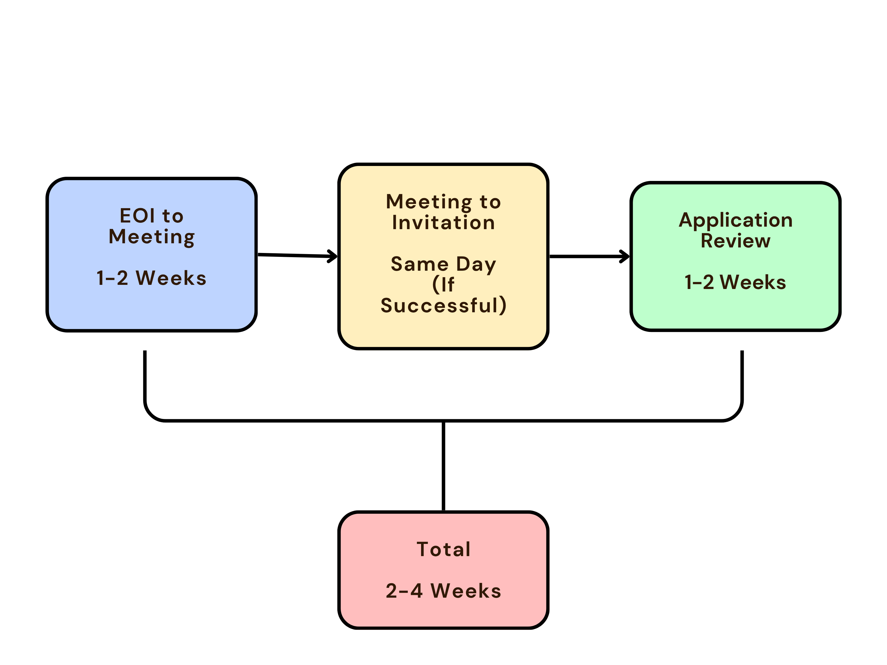

# Start Your Club Here

Welcome to TUSA! Glad to see you here.

Want to start your new club? No worries, this guide will assist you step by step until your shiny new club is ready to go.

---

## Before Starting

There are several things you need to pay attention and prepare before starting the club-creating process:

### What Is The Club For?

What has interested you in starting your club & society? Are you looking to bring students together to save the Tasmanian Devil, or whoever is interested in astrology? You will need to decide the aim of your club and what you hope to achieve. 

However, **remind that TUSA won't consider affiliating new clubs or societies that have the same objectives as existing clubs.** You can check all our existing clubs [on our website here.](https://tusa.org.au/find-a-club-society/) 

If you find there is a club that catering your new club's idea and objectives, please consider joining the existing club. If you don't, please contact us at [clubs@tusa.utas.edu.au](mailto:clubs@tusa.utas.edu.au)

### Gather Your People

You will need at least **5** current UTAS students to be eligible for affiliation, but we recommend starting with at least **10** current UTAS students, as this will allow your clubs to apply funding grants from TUSA.

While gathering your people, record their:

- Name
- Student ID
  - If the person is an associate (non-UTAS student)
- Email address

You can use [our template](https://tusa.org.au/wp-content/uploads/2021/02/Setting-Up-a-New-Club-or-Society-Step-2-Founding-Members-Template-TUSA.xlsx) for recording your people's information.

Among your people, you will need to nominate the executive committee to oversee club's operation, this includes:

- [President](http://www.tusa.org.au//wp-content/uploads/2021/02/Factsheet-role-of-president-TUSA.pdf)
- [Secretary](http://www.tusa.org.au//wp-content/uploads/2021/02/Factsheet-role-of-secretary-TUSA.pdf)
- [Treasurer](http://www.tusa.org.au//wp-content/uploads/2021/02/Factsheet-Role-of-Treasurer-TUSA.pdf)
- Any other optional committee roles as per your constitution, for more information please [find here](https://www.tusa.org.au/exec-committee-roles-2/)

Keep in mind that **OVER HALF of your Executive Committee have to be students** as you are creating a student club if affiliating with TUSA.

You are going to hold the official election for these roles during your **Inaugural General Meeting (IGM)**, which is a one-time compulsory meeting for creating your club

### Constitution

Constitution is a formal document that establishes and governs the club, it outlines the purpose, structural aims and objectives of the club, the roles of its office bearers, and many more.

Your club is required to write a constitution to become affiliated with TUSA. A template [can be downloaded here.](https://tusa.org.au/wp-content/uploads/2025/05/Club-and-Society-Model-Constitution-Draft-Template-26.05.25.docx).

While writing your constitution please pay attention that:

- Your club's aims and objectives are different from any other clubs, as this is required for your club to be affiliated.
- Do NOT USE "UTAS" or "University of Tasmania" in your club's name, use things like "Tasmanian University" or "TUSA" instead.
- Most TUSA Clubs are not incorporated and recognised as:
  - Sub-entity of TUSA
  - Not a legal entity
  - Cease to exist if disaffiliated from TUSA

After you have drafted your constitution, email a copy to us at [clubs@tusa.utas.edu.au](mailto:clubs@tusa.utas.edu.au) for comments and advice before officially submitting for approval of the **IGM**.

When your club is created, the constitution **must** exist already. If this is not the case, contact a TUSA Club Officer **IMMEDIATELY**.

If you want to revise your constitution, make sure you either:

- Involve it at the Annual General Meeting (AGM), which is a yearly recurring meeting for your club administrative work's assessment
  - Find the [AGM Agenda Template](https://tusa-dev.its.utas.edu.au/wp-content/uploads/2025/04/AGM-Agenda-Template-TUSA-2024.docx) and the [AGM Meetings Template](https://www.tusa.org.au/wp-content/uploads/2024/05/AGM-Minutes-TUSA-Template-2024.docx) on our website
- Hold a one-time Special General Meeting (SGM) for constitution purpose only

---

## Process Overview

Now it is time to start, the process includes following steps:

1. Submit your Expression of Interest (EOI)
2. Meet with a TUSA Club Officer
3. Once invitation received, submit a full affiliation application

Once your application is reviewed and approved, you club will be automatically created and affiliated with TUSA, rockin' roll!

**Please note that you CANNOT directly apply for affiliation. You MUST submit an EOI AND meet with a Club Officer beforehand.**

---

## Step 1: Submit your Expression of Interest (EOI)

You must submit an EOI via **EOI Form**, located on the TUSA website under Clubs & Societies before anything else. The EOI should at least tell TUSA:

- Your new club name
- Your contact details
- What the club is about
- Why you want to start this club

---

## Step 2: Meet with a Club Officer

Once your EOI form is submitted, a TUSA Club Officer will contact you for a meeting.

### Why?

The meeting is for you to:

- Discuss your club idea
- Understand the requirements for affiliation
- Get guidance on your constitution and documentation
- Ask any questions you have

### What To Prepare?

Please be ready with your meeting by having:

- Your club concept clearly in mind
- Any questions about requirements
- Ideas about who might be on your executive committee

---

## Step 3: Your Affiliation Application

If:

- Your meeting with the Club Officer is successful

- Your club idea is viable, and it meets all TUSA requirements

You will receive the invitation to submit the affiliation application. Half way there

### Any Documents?

You will need to prepare following documents for application:

| Document            | What It Is                                         |
| ------------------- | -------------------------------------------------- |
| **Constitution**    | Your club’s rules and governance structure         |
| **Meeting minutes** | Record of your founding meeting                    |
| **Member list**     | List of founding members (minimum number required) |

### What Should Be There?

Your application **MUST** include:

- Your club's name and acronym
- Your club's description and purpose
- All committee members' contact details
- Student IDs

---

## Step 4: What Happens After Approval

When your application is approved, the system automatically creates:

| Item                   | What is that?                              |
| ---------------------- | ------------------------------------------ |
| **Club group**         | Your private group on the TUSA website     |
| **President account**  | Login for managing the club                |
| **Committee accounts** | Logins for your executive members          |
| **Club store**         | For selling memberships and merchandise    |
| **Startup grant**      | Automatic application for new club funding |

**Note:** President account and committee accounts are institutional accounts, it is dedicated for the club and is different from your personal TUSA account, once new person has been commited to the role the account will be hand over to the new member.

You’ll receive login details by email and can start setting up your club.

---

## Timeline

The whole affiliation process will take approximately **2-4 weeks**, plan ahead if you want to be affiliated by a specific date.

---

## Frequently Asked Questions (FAQs)

### Can I skip the EOI and just apply for affiliation?

**NO**. The EOI and meeting are required steps. This ensures clubs are viable, and you understand the requirements before investing time in a full application.

### What if a similar club already exists?

The Club Officer will discuss this in your meeting. You may be able to join the existing club, or there may be room for a distinct club if the focus is different enough.

### How many members do I need?

There’s a minimum member requirement – the Club Officer will confirm the current number in your meeting.

### Do I need a constitution?

**Yes**. TUSA can provide a template constitution, or you can write your own following the required format.

### What if my application is rejected?

You’ll receive feedback on why. Common issues can often be fixed and resubmitted.

---

## Need Help?

**Email:** clubs@tusa.edu.au

**In Person:** Visit the TUSA office

**EOI Form:** Available on the TUSA website